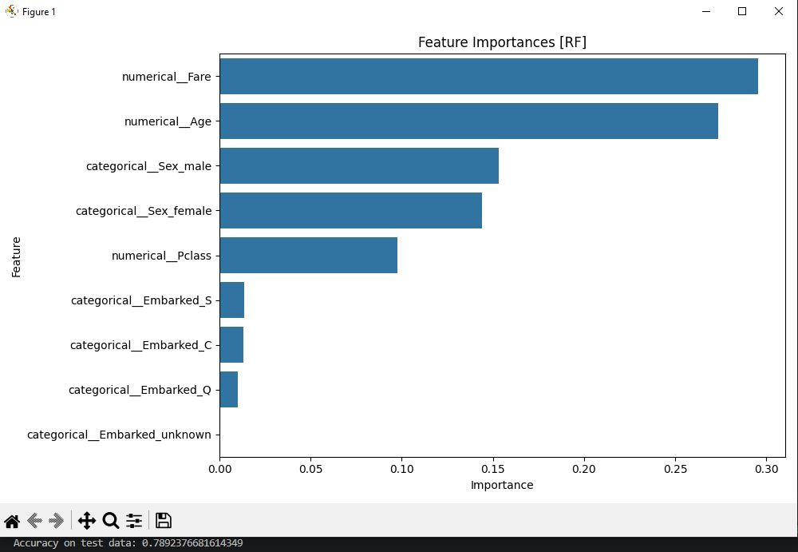

# Projekt: Data Analyzer

### Dieses Programm kann einen Datensatz analysieren und die Ergebnisse inkl. der Qualität des Fits ausgeben und visualisieren.

<br>

## Installation:

### Für dieses Programm werden lediglich Python inklusive Pandas, Seaborn und SKLearn benötigt. Die Ordner "src" und "data" müssen im selben Ordner liegen.

### Die im Beispiel genutzten Daten können unter https://www.kaggle.com/competitions/titanic/overview runtergeladen werden.

<br>

## Nutzung:

### Der zu analysierende Datensatz muss im Ordner "data" liegen und vom Format .csv sein. Der Dateiname des Datensatzes muss in der "main.py" angepasst werden:

```python 
daten = pd.read_csv("../data/**yourdatafile**.csv")
```

### Die Spaltennamen der gewünschten Features müssen in der Variable X eingegeben werden. Der Spaltenname des Targets muss in y eingegeben werden.

```python 
X = daten[["**yourfeature1**", "**yourfeature2**", ...]]

y = daten["**yourtarget**"]
```

### #Zur weiteren Verarbeitung der Daten müssen alle numerischen (z.B. Alter, Preis, Hausnummer, Distanz in m, ...) Kategorien in numerical_cats eingegeben werden.

### Zur Konfiguration der Analyse gibt es folgende Optionen:

### train_test_split kann entsprechend der funktionseigenen Parameter konfiguriert werden. Also Standard sind test_size = 0.25 und random_state = 42 festgelegt.

### Das Modell zur Analyse der Daten kann in der Variable pipe festgelegt werden:

```python 
pipe = preprocessing.create_pipeline(**yourmodell**, preprocessor)
```

### Die in der Analyse (GridSearchCV) zu variierenden Parameter und deren zu durchlaufenden Werte können in param_grid festgelegt werden:

```python  
param_grid = {
    "modell__**yourparamter1**": [**yourvalue1**, **yourvalue2**, ...],
    "modell__**yourparamter2**": [**yourvalue2**, **yourvalue2**, ...],
    "modell__**yourparamter3**": [**yourvalue3**, **yourvalue3**, ...]
}
```

### Der GridSearch kann selber konfiguriert werden. Die Standardwerte sind festgelegt auf cv = 5 und scoring="accuracy".

```python 
grid_search = training.run_grid_search(X_train, y_train, pipe, param_grid, cv=**yournumberoffolds**, scoring="**yourscoringmethod**")
```

### Abschließend wird das beste Modell in der Datei "my_model.pkl" gespeichert. Der Dateiname kann variiert werden.

```python 
joblib.dump(optimal_model,"../models/my_model.pkl")
```

### Um das gespeicherte Modell zu laden und an weiteren Daten zu testen, kann man die Datei "predict.py" nutzen. Im folgenden Befehl wird der Dateiname des gespeicherten Modells festgelegt:

```python 
loaded_model = joblib.load("../models/my_model.pkl")
```

### Die zu testenden Daten können in den übrigen Befehlen, analog zu "main.py" konfiguriert werden.

<br>

## Beispiel anhand der bekannten Titanic-Daten von Kaggle:

### Zu sehen sind die Ausgabe der Feature Importance als Balkendiagramm sowie der Test Data Accuracy als Textausgabe.



<br>

## Contributors:

### Dario (und Props an ChatGPT)